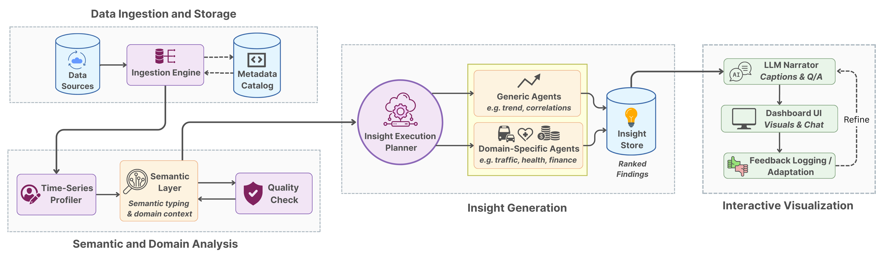

# ContextCap

ContextCap is a feed-back driven and agent-based system for **contextual captioning
of multivariate time-series datasets**. It was originally built for the EDBT
paper demo on motorway traffic volume, and is now structured as a reusable
mini-application.

At a high level, ContextCap lets you:

1. **Upload & profile** a CSV time-series dataset.
2. **Generate insights** using general and traffic-specific agents.
3. **Interact via charts & Q/A**, with answers grounded in numeric summaries
   and domain background notes.

---

## 1. Project layout

```text
backend/
  __init__.py
  app/
    __init__.py
    main.py              # FastAPI app (adapted from original contextcap_backend.py)
    config/
      __init__.py        # loads .env for OPENAI_API_KEY on import
      env.py             # tiny .env loader
      paths.py           # centralised filesystem paths
    agents/
      __init__.py
      general_agent.py   # general profiler (CLI + library)
      traffic_agent.py   # traffic + weather profiler (CLI + library)
config/
  rag_demo_config.json   # reference RAG configuration (documentation only)
prompts/
  demo_paper_context.txt # curated domain notes used in Q/A
  domain_prompt.txt      # prompt template for domain & variable inference
data/
  # optional; you can store CSVs here for offline profiling
logs/
  qa/
    accepted.txt         # thumbs-up Q/A feedback (appends)
    corrections.txt      # thumbs-down Q/A corrections (appends)
frontend/
  index.html             # single-page UI
  style.css              # layout & styling
  app.js                 # front-end logic, charts & fetch calls
requirements.txt
.env.example
```

The front-end is served by FastAPI:

- `GET /` returns `frontend/index.html`
- `GET /static/...` serves files from `frontend/` (so `/static/style.css` ↔ `frontend/style.css`).

---

## 2. Architecture overview



The system follows the architecture used in the paper (also shown above):

1. **Data Ingestion and Storage** – normalises uploaded or queried time-series
   tables into a time-indexed matrix, computes basic quality statistics, and
   stores the result in an in-memory dataset record.
2. **Semantic and Domain Analysis** – profiles each metric, infers roles,
   units, and high-level domain labels, and aggregates these into a semantic
   context that conditions later agents and captions.
3. **Insight Generation** – runs generic agents (trends, anomalies,
   correlations, segment comparisons) and domain-specific agents (for example,
   traffic + weather) and stores their outputs as structured, ranked insights.
4. **Interactive Visualisation and Narration** – drives the three-step web UI,
   turns ranked insights into natural-language captions, supports dataset-aware
   Q/A, and logs feedback for later refinement.

This structure mirrors the components discussed in the EDBT demo paper while
keeping the implementation small and easy to extend.

---

## 3. Quickstart

### 3.1. Install dependencies

From the project root (where this README lives):

```bash
pip install -r requirements.txt
```

The main dependencies are:

- `fastapi`, `uvicorn` – web server and API framework
- `pandas`, `numpy` – data handling and numeric computation
- `openai` – optional, for LLM-based profiling and captions
- `python-multipart` – file uploads

### 3.2. Configure your OpenAI key

1. Copy the example environment file:

   ```bash
   cp .env.example .env
   ```

2. Open `.env` and paste your key:

   ```text
   OPENAI_API_KEY=sk-your-real-key-here
   ```

   This is the only secret the backend expects. The key is used for:

   - LLM-based domain & variable inference (`domain_prompt.txt`),
   - natural-language captions for numeric insights,
   - dataset-aware Q/A.

   If no key is set, the system still works, but will fall back to simple
   placeholder captions and non-LLM answers where necessary.

### 3.3. Run the backend

From the project root:

```bash
uvicorn backend.app.main:app --reload
```

Then open your browser at:

```
http://localhost:8000/
```

You should see the three-step ContextCap interface.

---

## 4. Using the UI

### Step 1 – Upload & profile

1. Click **"Choose file"** and upload a CSV file.
2. Click **"Upload & Profile"**.
3. The backend:
   - parses the `date_time` column and sorts by timestamp,
   - constructs a basic quality summary,
   - optionally calls an LLM to infer domains, variable roles, and targets,
   - stores the time-indexed DataFrame in memory under a generated `dataset_id`.

The UI then shows:

- **Domain candidates** (from the LLM or a heuristic fallback),
- **Quality summary** (rows, time range, missing/outlier ratios),
- **Variable roles** and inferred units,
- **Dataset preview** (first rows, optionally restricted to a date range).

Confirm the quality summary and domain selection to enable Step 2.

> Note: The default dataset used in the EDBT paper is the *Metro Interstate
> Traffic Volume* dataset: motorway traffic entering a large US city,
> between 2012–2018. The curated background notes for this dataset live in
> `prompts/demo_paper_context.txt` and are fed into Q/A as trusted context.

### Step 2 – Insight generation

When you click **"Run Insight Generation"**, the backend:

- Re-computes quality metrics for the selected date window,
- Builds:
  - a **general profile** (extremes, correlations, etc.),
  - a **traffic profile** (hour-of-day, weekday, holiday, weather effects),
- Runs the insight pipeline (trend, anomaly, correlation, segment comparisons),
- Optionally generates **natural-language captions** for each insight via LLM,
- Produces a compact **viz summary** used by the charts on Step 3.

The UI shows:
- A **ranked list of insights** (with severity, confidence and score),
- A detail panel with the JSON evidence for the selected insight.

### Step 3 – Interactive charts & Q/A

On the final step, you can:

- Browse charts of:
  - target over time,
  - holiday vs non-holiday averages,
  - weather impact on the target.
- Ask questions such as:
  - *"Is it better to drive or use public transport on holidays?"*
  - *"How does heavy rain affect morning congestion?"*

The backend answers by stitching together:

- the curated domain pre-context,
- numeric summaries from the general/traffic profiles,
- insight captions and quality metadata.

Thumbs-up / thumbs-down feedback is appended to `logs/qa/accepted.txt` and
`logs/qa/corrections.txt` respectively, so you can later analyse how well
the system performed.

---
